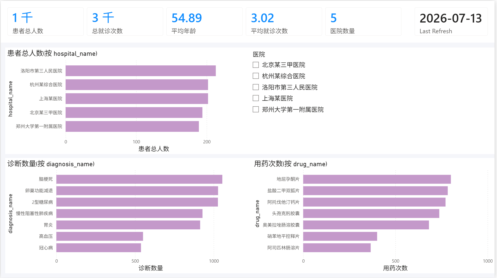
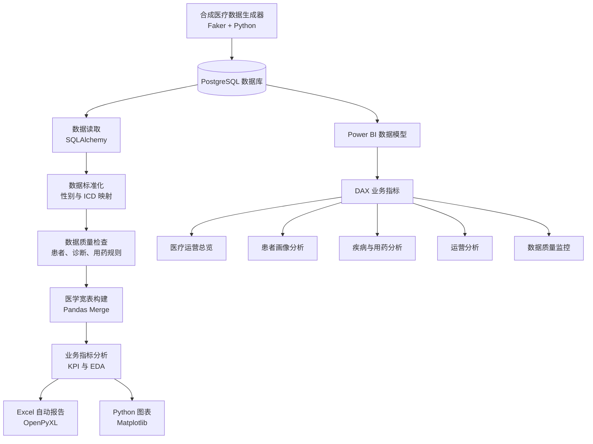
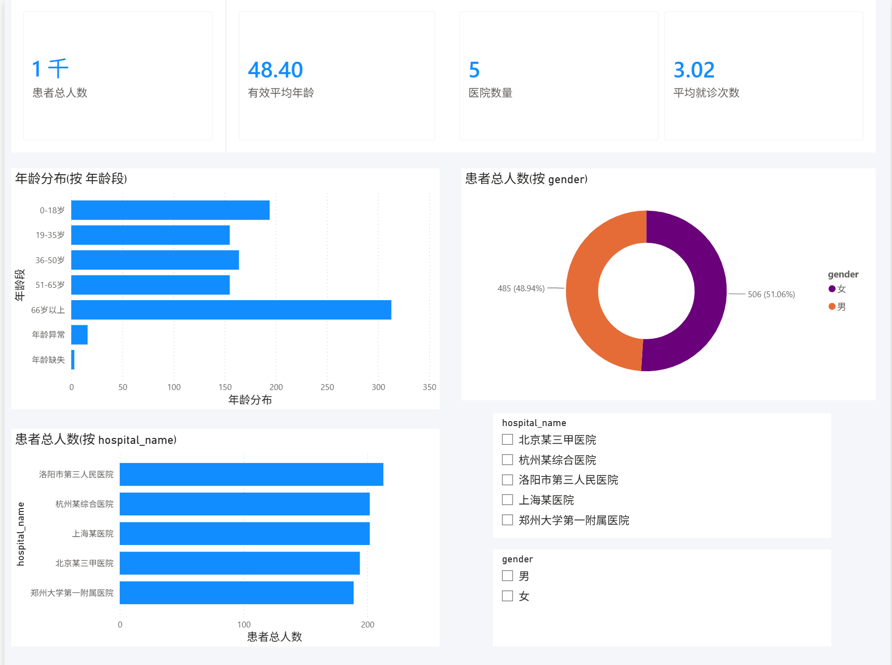
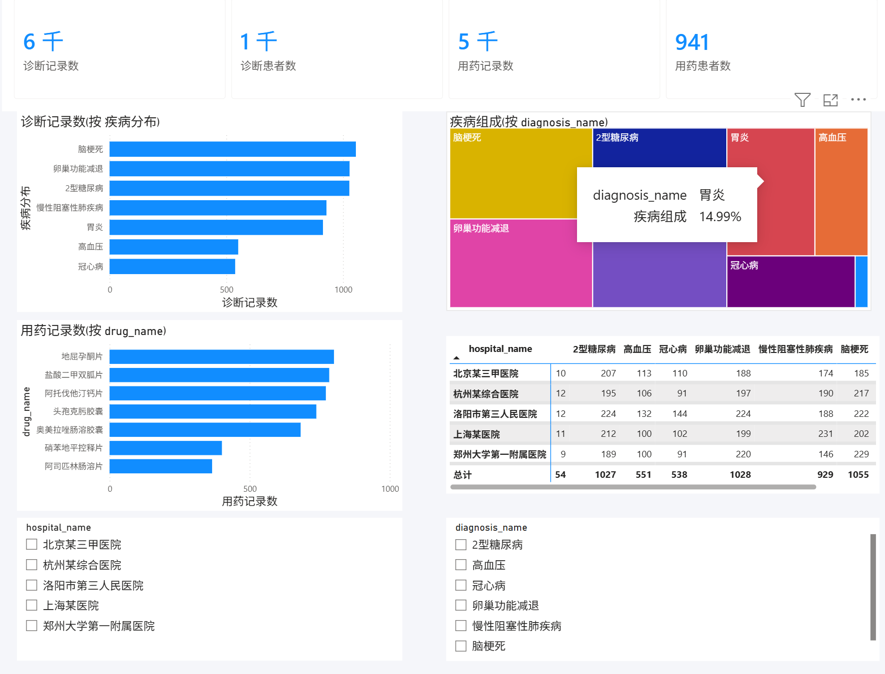
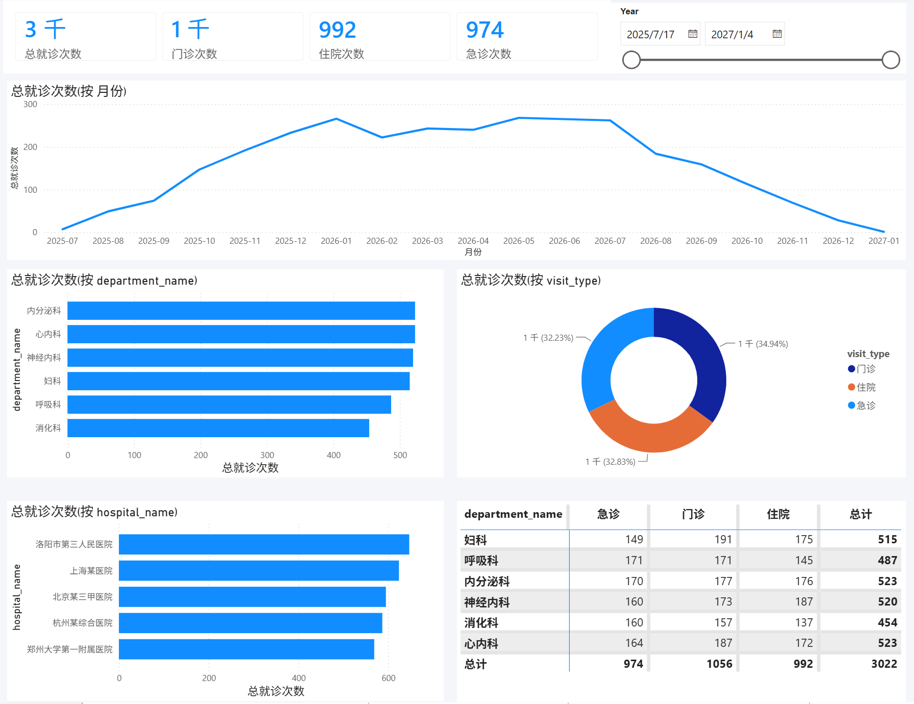
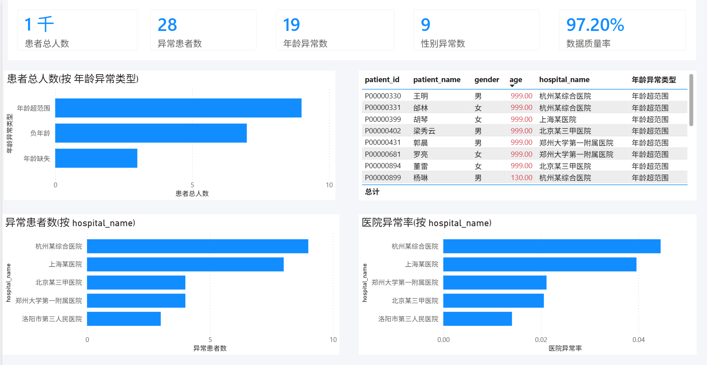

# 🏥 Medical Data Analysis Platform

> 基于 Python、PostgreSQL 与 Power BI 构建的端到端医疗数据分析平台。



## 📌 项目简介

本项目模拟医疗机构的数据分析与数据治理流程，覆盖合成医疗数据生成、PostgreSQL 数据存储、数据标准化、数据质量检查、医学宽表构建、指标分析、自动化报告及 Power BI 交互式看板。

项目主要用于展示从原始医疗业务数据到可视化决策支持的完整分析链路。

## 🏗 系统架构



## 📊 Dashboard Showcase

### 🏠 Dashboard


---

### 👤 Patient Analysis



---

### 🩺 Clinical Analytics



---

### 🏥 Operational Analytics



---

### 🛡 Data Quality Dashboard



## ✨ Features

### 📂 Data Generation

- Generate **1000+ synthetic patients**
- Generate **3000+ visit records**
- Generate diagnosis and medication records
- Inject configurable abnormal data for quality testing

---

### 🗄 Data Management

- PostgreSQL healthcare database
- Relational data model
- Modular data loader
- Environment-based configuration (.env)

---

### 🧹 Data Quality

- Gender standardization
- ICD diagnosis standardization
- Age validation
- Diagnosis validation
- Medication validation
- Hospital quality ranking

---

### 📈 Business Analytics

- Patient profile analysis
- Clinical analytics
- Operational analytics
- Hospital KPI
- Medical wide table
- Automated Excel reports

---

### 📊 Business Intelligence

- Interactive Power BI Dashboard
- DAX KPI measures
- Multi-page dashboards
- Drill-down analysis
- Data quality monitoring

## 🛠 Tech Stack

| Layer | Technology | Responsibility |
|--------|------------|----------------|
| Programming | Python 3.12 | Data generation, cleaning and analytics |
| Database | PostgreSQL 18 | Healthcare data storage |
| Data Access | SQLAlchemy | Database connection and ORM |
| Data Processing | Pandas | ETL and analytical processing |
| Data Visualization | Matplotlib | Static charts and reports |
| Business Intelligence | Power BI | Interactive dashboards |
| BI Modeling | DAX | KPI calculation and business metrics |
| Data Generation | Faker | Synthetic healthcare dataset generation |
| Report Export | OpenPyXL | Excel report generation |
| Configuration | python-dotenv | Environment management |

## 📁 Project Structure

```text
medical_data_analysis_platform
│
├── analysis/          # Business analytics
├── generator/         # Synthetic data generator
├── loader/            # PostgreSQL data loader
├── quality/           # Data quality rules
├── standard/          # Data standardization
├── visualization/     # Python charts
├── report/            # Excel report
├── powerbi/           # Power BI dashboard
├── docs/
│   └── images/
├── output/
├── sql/
├── main.py
├── config.py
└── README.md
```

## 🚀 Quick Start

### 1. Clone Repository

```bash
git clone https://github.com/yourname/medical_data_analysis_platform.git
```

### 2. Install Dependencies

```bash
pip install -r requirements.txt
```

### 3. Configure Environment

Create `.env`

```text
DB_HOST=localhost
DB_PORT=5432
DB_NAME=medical_data_practice
DB_USER=postgres
DB_PASSWORD=your_password
```

### 4. Run

```bash
python main.py
```

### 5. Open Power BI

Open

```
powerbi/medical_data_analysis_dashboard.pbix
```

## 📁 Project Structure

```text
medical_data_analysis_platform
│
├── analysis/          # Business analytics
├── generator/         # Synthetic healthcare data generation
├── loader/            # PostgreSQL data loader
├── quality/           # Data quality validation
├── standard/          # Data standardization
├── visualization/     # Python charts
├── report/            # Excel report generation
├── powerbi/           # Power BI dashboard
├── docs/
│   └── images/
├── sql/
├── output/
├── config.py
├── main.py
└── README.md
```

## 📜 License

This project is released under the MIT License.